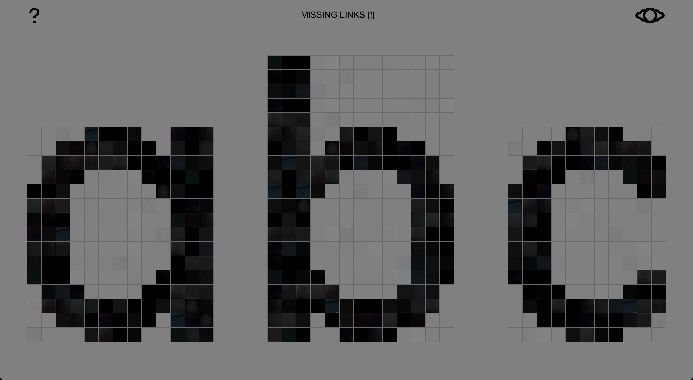

# Missing-links [!]

Le micro-site **Missing Links [!]** se veut une exploration du phénomène du *Link Rot* – le pourrissement des liens hypertextes sur le web – c’est-à-dire la disparition progressive des redirections.  
Un « lien mort » ne mène plus au contenu voulu, créant des vides dans la mémoire du net.  
Le phénomène met en tension la nature figée du système hyperliens avec celle d’un internet  
qui se veut plus organique.

---

L’idée de ce site est née lors de la conférence de [Raphaël Bastide](https://raphaelbastide.com/) pendant les [Jeudis de Lure (La typographie: Outil… or not outil?)](https://delure.org/les-a-cotes/jeudis-de-lure), qui a fait, entre autres, la démonstration de deux projets :

- La fonte libre [Terminal Grotesque](https://velvetyne.fr/fonts/terminal-grotesque/), une *pixel font*
- Sa *greeting card* informatique pour [l’année 2018](https://raphaelbastide.com/greetings/2018/), où le message *Happy New Year 2018* est composé de lettres-images, chaque caractère étant une image distincte plutôt qu’un simple texte. Si une des images vient à disparaître du serveur sur lequel elle est hébergée, cela altérera le message.

---

Ces deux références m’ont inspiré la création de cet espace, articulé autour de trois lettres :  
**A**, **B** et **C**, issues de la fonte Terminal Grotesque.  
Chaque lettre a été reconstruite en grille de pixels, mais ici, chaque pixel noir ou gris est remplacé par une image hébergée quelque part sur le web. En dessous de chaque image se trouve son négatif.

Si un lien vers une de ces images devient inactif, cela modifie visuellement la lettre.  
Ainsi, la forme même des lettres évolue dans le temps, en fonction de la vitalité ou de la disparition des liens.

Le projet ne comporte volontairement que trois lettres car multiplier les requêtes vers des serveurs externes pour l’ensemble de l’alphabet serait trop gourmand en énergie.

---

En arrivant sur le site, vous découvrez les lettres telles qu’elles sont aujourd’hui, potentiellement déjà altérées.  
Pour voir le modèle d’origine, cliquez sur l’icône œil en haut à droite.

Le site est mis en ligne en mai 2025.  

Une archive des transformations et altérations sera conservée.

---

© Terminal Grotesque by Raphaël Bastide, with the contribution of Jérémy Landes.  
Distributed by [velvetyne.fr](https://velvetyne.fr).
